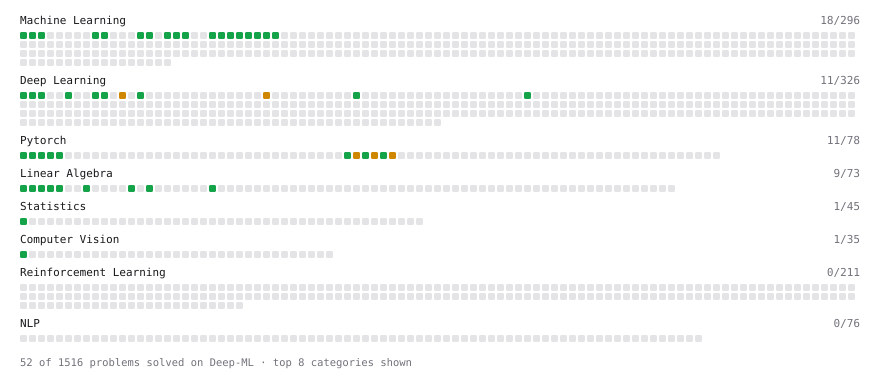

# Deep-ML

My machine learning practice from [Deep-ML](https://www.deep-ml.com). Every solution here was written by hand.

**68** solved · 61 problems · 1 labs · 6 math

[**Browse the interactive portfolio**](https://petrovmarko.github.io/deep-ml/) to replay this filling in over time.

## Problems

| | Difficulty | Solved | |
| --- | --- | --- | --- |
| [Add a Bias Vector to a Batch via Broadcasting](https://www.deep-ml.com/problems/882) | easy | 2026-10-01 | [solution](problems/0882-add-a-bias-vector-to-a-batch-via-broadcasting) |
| [Batch Iterator for Dataset](https://www.deep-ml.com/problems/30) | easy | 2026-09-19 | [solution](problems/0030-batch-iterator-for-dataset) |
| [Calculate 2x2 Matrix Inverse](https://www.deep-ml.com/problems/8) | easy | 2026-07-31 | [solution](problems/0008-calculate-2x2-matrix-inverse) |
| [Calculate Accuracy Score](https://www.deep-ml.com/problems/36) | easy | 2026-09-20 | [solution](problems/0036-calculate-accuracy-score) |
| [Calculate Covariance Matrix](https://www.deep-ml.com/problems/10) | easy | 2026-07-31 | [solution](problems/0010-calculate-covariance-matrix) |
| [Calculate Dice Score for Classification](https://www.deep-ml.com/problems/73) | easy | 2026-09-27 | [solution](problems/0073-calculate-dice-score-for-classification) |
| [Calculate Image Brightness](https://www.deep-ml.com/problems/70) | easy | 2026-09-25 | [solution](problems/0070-calculate-image-brightness) |
| [Calculate Jaccard Index for Binary Classification](https://www.deep-ml.com/problems/72) | easy | 2026-09-27 | [solution](problems/0072-calculate-jaccard-index-for-binary-classification) |
| [Calculate Mean by Row or Column](https://www.deep-ml.com/problems/4) | easy | 2026-07-31 | [solution](problems/0004-calculate-mean-by-row-or-column) |
| [Calculate R-squared for Regression Analysis](https://www.deep-ml.com/problems/69) | easy | 2026-09-25 | [solution](problems/0069-calculate-r-squared-for-regression-analysis) |
| [Calculate Root Mean Square Error (RMSE)](https://www.deep-ml.com/problems/71) | easy | 2026-09-25 | [solution](problems/0071-calculate-root-mean-square-error-rmse) |
| [Compute a Gradient with PyTorch Autograd](https://www.deep-ml.com/problems/884) | easy | 2026-10-01 | [solution](problems/0884-compute-a-gradient-with-pytorch-autograd) |
| [Compute Multi-class Cross-Entropy Loss](https://www.deep-ml.com/problems/134) | easy | 2026-09-30 | [solution](problems/0134-compute-multi-class-cross-entropy-loss) |
| [Convert Vector to Diagonal Matrix](https://www.deep-ml.com/problems/35) | easy | 2026-09-20 | [solution](problems/0035-convert-vector-to-diagonal-matrix) |
| [Create a Float Tensor from a Python List](https://www.deep-ml.com/problems/880) | easy | 2026-09-30 | [solution](problems/0880-create-a-float-tensor-from-a-python-list) |
| [Derivatives of Activation Functions](https://www.deep-ml.com/problems/217) | easy | 2026-09-30 | [solution](problems/0217-derivatives-of-activation-functions) |
| [Feature Scaling Implementation](https://www.deep-ml.com/problems/16) | easy | 2026-08-06 | [solution](problems/0016-feature-scaling-implementation) |
| [Generate a Confusion Matrix for Binary Classification](https://www.deep-ml.com/problems/75) | easy | 2026-09-27 | [solution](problems/0075-generate-a-confusion-matrix-for-binary-classification) |
| [Implement a Linear Layer Forward Pass with Matrix Multiplication](https://www.deep-ml.com/problems/883) | easy | 2026-10-01 | [solution](problems/0883-implement-a-linear-layer-forward-pass-with-matrix-multiplication) |
| [Implement a Simple Residual Block with Shortcut Connection](https://www.deep-ml.com/problems/113) | easy | 2026-10-08 | [solution](problems/0113-implement-a-simple-residual-block-with-shortcut-connection) |
| [Implement Compressed Row Sparse Matrix (CSR) Format Conversion](https://www.deep-ml.com/problems/65) | easy | 2026-09-23 | [solution](problems/0065-implement-compressed-row-sparse-matrix-csr-format-conversion) |
| [Implement F-Score Calculation for Binary Classification](https://www.deep-ml.com/problems/61) | easy | 2026-09-25 | [solution](problems/0061-implement-f-score-calculation-for-binary-classification) |
| [Implement Gini Impurity Calculation for a Set of Classes](https://www.deep-ml.com/problems/64) | easy | 2026-09-25 | [solution](problems/0064-implement-gini-impurity-calculation-for-a-set-of-classes) |
| [Implement Global Average Pooling](https://www.deep-ml.com/problems/114) | easy | 2026-10-08 | [solution](problems/0114-implement-global-average-pooling) |
| [Implement Precision Metric](https://www.deep-ml.com/problems/46) | easy | 2026-09-20 | [solution](problems/0046-implement-precision-metric) |
| [Implement Recall Metric in Binary Classification](https://www.deep-ml.com/problems/52) | easy | 2026-09-24 | [solution](problems/0052-implement-recall-metric-in-binary-classification) |
| [Implement ReLU Activation Function](https://www.deep-ml.com/problems/42) | easy | 2026-09-20 | [solution](problems/0042-implement-relu-activation-function) |
| [Implement ReLU and Leaky ReLU](https://www.deep-ml.com/problems/1226) | easy | 2026-10-01 | [solution](problems/1226-implement-relu-and-leaky-relu) |
| [Implement Ridge Regression Loss Function](https://www.deep-ml.com/problems/43) | easy | 2026-09-21 | [solution](problems/0043-implement-ridge-regression-loss-function) |
| [Implementation of Log Softmax Function](https://www.deep-ml.com/problems/39) | easy | 2026-09-19 | [solution](problems/0039-implementation-of-log-softmax-function) |
| [KL Divergence Between Two Normal Distributions](https://www.deep-ml.com/problems/56) | easy | 2026-09-25 | [solution](problems/0056-kl-divergence-between-two-normal-distributions) |
| [Leaky ReLU Activation Function](https://www.deep-ml.com/problems/44) | easy | 2026-09-20 | [solution](problems/0044-leaky-relu-activation-function) |
| [Linear Kernel Function](https://www.deep-ml.com/problems/45) | easy | 2026-09-20 | [solution](problems/0045-linear-kernel-function) |
| [Linear Regression Using Gradient Descent](https://www.deep-ml.com/problems/15) | easy | 2026-08-06 | [solution](problems/0015-linear-regression-using-gradient-descent) |
| [Linear Regression Using Normal Equation](https://www.deep-ml.com/problems/14) | easy | 2026-08-06 | [solution](problems/0014-linear-regression-using-normal-equation) |
| [Matrix-Vector Dot Product](https://www.deep-ml.com/problems/1) | easy | 2026-07-30 | [solution](problems/0001-matrix-vector-dot-product) |
| [Mean Squared Error from Scratch](https://www.deep-ml.com/problems/1228) | easy | 2026-10-01 | [solution](problems/1228-mean-squared-error-from-scratch) |
| [One-Hot Encoding of Nominal Values](https://www.deep-ml.com/problems/34) | easy | 2026-09-20 | [solution](problems/0034-one-hot-encoding-of-nominal-values) |
| [Random Shuffle of Dataset](https://www.deep-ml.com/problems/29) | easy | 2026-09-20 | [solution](problems/0029-random-shuffle-of-dataset) |
| [Reshape and Transpose a Tensor](https://www.deep-ml.com/problems/881) | easy | 2026-10-01 | [solution](problems/0881-reshape-and-transpose-a-tensor) |
| [Reshape Matrix](https://www.deep-ml.com/problems/3) | easy | 2026-07-30 | [solution](problems/0003-reshape-matrix) |
| [Scalar Multiplication of a Matrix](https://www.deep-ml.com/problems/5) | easy | 2026-07-31 | [solution](problems/0005-scalar-multiplication-of-a-matrix) |
| [Sigmoid Activation Function Understanding](https://www.deep-ml.com/problems/22) | easy | 2026-08-06 | [solution](problems/0022-sigmoid-activation-function-understanding) |
| [Single Linear Neuron Forward](https://www.deep-ml.com/problems/1224) | easy | 2026-10-01 | [solution](problems/1224-single-linear-neuron-forward) |
| [Single Neuron](https://www.deep-ml.com/problems/24) | easy | 2026-09-05 | [solution](problems/0024-single-neuron) |
| [Sinusoidal Positional Encoding](https://www.deep-ml.com/problems/906) | easy | 2026-10-05 | [solution](problems/0906-sinusoidal-positional-encoding) |
| [Softmax Activation Function Implementation ](https://www.deep-ml.com/problems/23) | easy | 2026-08-06 | [solution](problems/0023-softmax-activation-function-implementation) |
| [Transformation Matrix from Basis B to C](https://www.deep-ml.com/problems/27) | easy | 2026-09-13 | [solution](problems/0027-transformation-matrix-from-basis-b-to-c) |
| [Transpose of a Matrix](https://www.deep-ml.com/problems/2) | easy | 2026-07-30 | [solution](problems/0002-transpose-of-a-matrix) |
| [Binary Cross-Entropy from Logits](https://www.deep-ml.com/problems/1229) | medium | 2026-10-01 | [solution](problems/1229-binary-cross-entropy-from-logits) |
| [Derivative of Softmax](https://www.deep-ml.com/problems/219) | medium | 2026-09-30 | [solution](problems/0219-derivative-of-softmax) |
| [Implement a Transformer Encoder Block](https://www.deep-ml.com/problems/905) | medium | 2026-10-08 | [solution](problems/0905-implement-a-transformer-encoder-block) |
| [Implement Batch Normalization for BCHW Input](https://www.deep-ml.com/problems/115) | medium | 2026-10-08 | [solution](problems/0115-implement-batch-normalization-for-bchw-input) |
| [Implement Masked Self-Attention](https://www.deep-ml.com/problems/107) | medium | 2026-10-03 | [solution](problems/0107-implement-masked-self-attention) |
| [Implement Self-Attention Mechanism](https://www.deep-ml.com/problems/53) | medium | 2026-10-03 | [solution](problems/0053-implement-self-attention-mechanism) |
| [Numerically Stable Softmax](https://www.deep-ml.com/problems/1227) | medium | 2026-10-01 | [solution](problems/1227-numerically-stable-softmax) |
| [Simple Convolutional 2D Layer](https://www.deep-ml.com/problems/41) | medium | 2026-10-08 | [solution](problems/0041-simple-convolutional-2d-layer) |
| [Single Neuron with Backpropagation](https://www.deep-ml.com/problems/25) | medium | 2026-10-08 | [solution](problems/0025-single-neuron-with-backpropagation) |
| [Two-Layer MLP Forward Pass](https://www.deep-ml.com/problems/1225) | medium | 2026-10-01 | [solution](problems/1225-two-layer-mlp-forward-pass) |
| [Implement Multi-Head Attention](https://www.deep-ml.com/problems/94) | hard | 2026-10-03 | [solution](problems/0094-implement-multi-head-attention) |
| [Implement Multi-Head Self-Attention](https://www.deep-ml.com/problems/904) | hard | 2026-10-04 | [solution](problems/0904-implement-multi-head-self-attention) |

## Labs

| | Difficulty | Solved | |
| --- | --- | --- | --- |
| [Design Your Own Activation Function](https://www.deep-ml.com/labs/9) | easy | 2026-10-01 | [solution](labs/0009-design-your-own-activation-function) |

## Math

| | Difficulty | Solved | |
| --- | --- | --- | --- |
| [Derivatives and Gradients](https://www.deep-ml.com/math-problems/1) | easy | 2026-09-30 | [solution](math/0001-derivatives-and-gradients) |
| [Gradient Descent Updates](https://www.deep-ml.com/math-problems/5) | easy | 2026-09-30 | [solution](math/0005-gradient-descent-updates) |
| [Backpropagation and the Chain Rule](https://www.deep-ml.com/math-problems/4) | medium | 2026-10-02 | [solution](math/0004-backpropagation-and-the-chain-rule) |
| [Log-Likelihood Gradients](https://www.deep-ml.com/math-problems/38) | medium | 2026-09-30 | [solution](math/0038-log-likelihood-gradients) |
| [Neural Network Derivatives](https://www.deep-ml.com/math-problems/3) | medium | 2026-10-01 | [solution](math/0003-neural-network-derivatives) |
| [Softmax and Cross-Entropy](https://www.deep-ml.com/math-problems/32) | medium | 2026-09-30 | [solution](math/0032-softmax-and-cross-entropy) |

---

_This file is regenerated by Deep-ML on every push._
